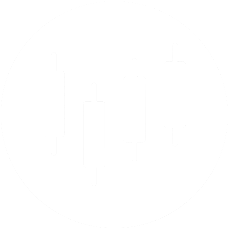

<p align="center">
  
</p>

<h1 align="center">BinaryFusion</h1>

<p align="center">
  <strong>AI-Powered Trading Signal Platform</strong><br>
  Real-time multi-indicator analysis for Forex, Crypto &amp; Stocks
</p>

<p align="center">
  
  
  
  
  
</p>

---

## 📋 Table of Contents

- [Overview](#-overview)
- [Key Features](#-key-features)
- [Screenshots](#-screenshots)
- [Architecture](#-architecture)
- [Tech Stack](#-tech-stack)
- [Trading Engine](#-trading-engine)
- [Project Structure](#-project-structure)
- [Getting Started](#-getting-started)
  - [Prerequisites](#prerequisites)
  - [Installation](#installation)
  - [Environment Configuration](#environment-configuration)
  - [Database Setup](#database-setup)
  - [Running the Development Server](#running-the-development-server)
- [Deployment](#-deployment)
- [API Endpoints](#-api-endpoints)
- [Admin Panel](#-admin-panel)
- [Background Jobs](#-background-jobs)
- [Contributing](#-contributing)
- [License](#-license)

---

## 🧭 Overview

**BinaryFusion** is a full-stack web application that delivers AI-powered trading signals by fusing **eight technical indicators** through a consensus-based voting system. It provides real-time market analysis across multiple asset classes — including Forex pairs, cryptocurrencies, and equities — through an intuitive dark-themed dashboard.

The platform is built with **Django 5.1**, backed by **PostgreSQL**, and deployed on **Render** with Gunicorn. It incorporates a complete user management system with subscription tiers, cryptocurrency payment processing via **NOWPayments**, Google OAuth login, an economic calendar feed, and a built-in support ticketing system.

> **Live:** [binaryfusion.onrender.com](https://binaryfusion.onrender.com)

---

## ✨ Key Features

### 📈 Trading Signal Engine
- **8-Indicator Fusion Analysis** — RSI, MACD, Bollinger Bands, ADX, Stochastic Oscillator, EMA Crossover, ATR, and Ichimoku Cloud
- **Consensus Voting System** — Aggregates all indicator signals (Bullish / Bearish / Neutral) and derives a majority verdict
- **Dynamic Confidence Scoring** — Per-indicator and composite accuracy percentages based on signal strength
- **Risk Management** — Automatic ATR-based Stop-Loss and Take-Profit levels (1.5× SL / 2.0× TP multipliers)
- **Interactive Candlestick Charts** — TradingView-style dark theme charts with EMA overlays, generated via `mplfinance`
- **Real-time Symbol Search** — Autocomplete-powered asset lookup via `yahooquery`
- **Signal Feedback** — Users can like/dislike predictions for quality tracking

### 👤 User & Account Management
- **Registration & Authentication** — Custom registration, login/logout, and Django's built-in password reset flow (email-based)
- **Google OAuth** — One-click Google Sign-In via `django-allauth`
- **User Profiles** — Profile picture upload, Telegram handle, phone, timezone, and theme preferences
- **Two-Tier Subscription Model** — Free (5 tokens) and Premium (100 tokens) tiers
- **Token Economy** — Each signal prediction costs 1 token; auto-refill when balance permits

### 💳 Payment & Billing
- **USDT Cryptocurrency Deposits** — Manual Binance Pay deposits with admin approval workflow
- **NOWPayments Integration** — Automated crypto invoice creation with IPN (Instant Payment Notification) webhook processing
- **Balance Management** — Deposit, subscribe, renew, and auto-renew with complete transaction history
- **Payment History** — Full audit trail with status tracking (Pending → Successful / Cancelled / Partially Paid)

### 📅 Economic Calendar
- **Forex Factory Data** — Daily-synced economic events from an external API
- **Impact Color-Coding** — High (red), Medium (orange), Low (green) impact indicators
- **DataTables Integration** — Searchable, sortable, paginated event table in both admin and frontend

### 🎫 Support System
- **Ticket Management** — Users submit tickets categorized by type (Billing, Technical, General)
- **Rich Text Descriptions** — TinyMCE-powered HTML editor for detailed issue reporting
- **Admin Response Flow** — Admins respond via the Django admin panel with ticket status tracking

### ⚙️ Platform
- **Dark/Light Theme Toggle** — System default, light, and dark mode preferences persisted per user
- **Responsive Design** — Fully responsive UI for desktop and mobile
- **Terms of Service & Privacy Policy** — Dedicated legal pages
- **WhiteNoise Static Serving** — Compressed and cached static files for production performance

---

## 📸 Screenshots

### Landing Page


### Trading Signal Dashboard


### Signal Results & Chart


### Indicator Analysis Panel


### User Dashboard


### Subscription & Payment


### Payment History


### Settings & Profile


<details>
<summary><strong>More Screenshots</strong></summary>


<br>

<br>

<br>


### Legacy UI


</details>

---

## 🏗 Architecture

```
┌─────────────────────────────────────────────────────────────────────┐
│                          Client (Browser)                          │
│  ┌────────────┐  ┌───────────────┐  ┌────────────┐  ┌───────────┐ │
│  │ Landing    │  │ Signal App    │  │ Dashboard  │  │ Auth Pages│ │
│  │ (index)    │  │ (predictor)   │  │ (accounts) │  │           │ │
│  └────────────┘  └───────────────┘  └────────────┘  └───────────┘ │
└────────────────────────────┬────────────────────────────────────────┘
                             │ AJAX / Form POST
                             ▼
┌─────────────────────────────────────────────────────────────────────┐
│                      Django Application Layer                       │
│                                                                     │
│  ┌──────────────────┐  ┌────────────────────┐  ┌────────────────┐  │
│  │   BinaryFusion   │  │     predictor      │  │    accounts    │  │
│  │   (Root Config)  │  │  ┌──────────────┐  │  │ ┌────────────┐ │  │
│  │  • settings.py   │  │  │trading_logic │  │  │ │  Profile   │ │  │
│  │  • urls.py       │  │  │  .py         │  │  │ │  Payment   │ │  │
│  │  • wsgi/asgi     │  │  └──────────────┘  │  │ │  Subscript │ │  │
│  └──────────────────┘  │  • views.py        │  │ │  Tickets   │ │  │
│                        │  • models.py       │  │ └────────────┘ │  │
│                        └────────────────────┘  │ • tasks.py     │  │
│                                                │ • signals.py   │  │
│                                                └────────────────┘  │
│                                                                     │
│  ┌──────────────┐  ┌───────────────┐  ┌──────────────────────────┐ │
│  │ APScheduler  │  │ django-allauth│  │    NOWPayments IPN       │ │
│  │ (Background) │  │ (Google OAuth)│  │    (Webhook Listener)    │ │
│  └──────────────┘  └───────────────┘  └──────────────────────────┘ │
└────────────────────────────┬────────────────────────────────────────┘
                             │
            ┌────────────────┼──────────────────┐
            ▼                ▼                  ▼
    ┌──────────────┐  ┌────────────┐   ┌──────────────────┐
    │  PostgreSQL  │  │  Yahoo     │   │ Forex Calendar   │
    │  Database    │  │  Finance   │   │ API              │
    └──────────────┘  └────────────┘   └──────────────────┘
```

---

## 🛠 Tech Stack

| Layer | Technology |
|-------|-----------|
| **Backend Framework** | Django 5.1.7 |
| **Language** | Python 3.11 |
| **Database** | PostgreSQL (via `psycopg2-binary`) |
| **Authentication** | Django Auth + `django-allauth` (Google OAuth) |
| **Market Data** | `yfinance` & `yahooquery` (Yahoo Finance API) |
| **Data Analysis** | `pandas`, `numpy` |
| **Charting** | `matplotlib`, `mplfinance` |
| **Task Scheduling** | `APScheduler` (Background cron jobs) |
| **Payment Gateway** | NOWPayments (Crypto invoicing + IPN) |
| **Rich Text Editor** | `django-tinymce` |
| **Static Files** | `whitenoise` (Compressed static serving) |
| **WSGI Server** | Gunicorn |
| **Deployment** | Render (render.yaml) |
| **Security** | `PyJWT`, `cryptography`, HMAC signature verification |
| **File Cleanup** | `django-cleanup` (Auto-remove orphaned media) |
| **Frontend** | Vanilla HTML/CSS/JS (Dark-themed, responsive) |

---

## 📊 Trading Engine

The core prediction engine lives in [`predictor/trading_logic.py`](predictor/trading_logic.py) and implements an **8-indicator fusion strategy** on 5-minute candlestick data:

### Indicators

| Indicator | Parameters | Signal Logic |
|-----------|-----------|-------------|
| **RSI** | Period: 14, Overbought: 70, Oversold: 30 | Bullish when < 30, Bearish when > 70 |
| **MACD** | Fast: 12, Slow: 26, Signal: 9 | Bullish when MACD > Signal with positive histogram |
| **Bollinger Bands** | Period: 20, Std Dev: 2 | Bullish when price breaks above upper band |
| **ADX** | Period: 14 | Bullish/Bearish when ADX > 25 with DI divergence |
| **Stochastic** | %K: 14, %D: 3, Smooth: 3 | Bullish when K < 20 crossing above D |
| **EMA Crossover** | Fast: 10, Slow: 20 | Bullish when fast EMA > slow EMA with price confirmation |
| **ATR** | Period: 14 | Directional bias based on volatility expansion |
| **Ichimoku Cloud** | Tenkan: 9, Kijun: 26, Senkou B: 52 | Bullish when price above cloud with TK cross |

### Signal Generation Flow

```
Market Data (Yahoo Finance - 5min candles, 3-day lookback)
    │
    ▼
Calculate All 8 Indicators
    │
    ▼
Each Indicator Votes: Bullish 🟢 / Bearish 🔴 / Neutral ⚪
    │
    ▼
Majority Vote → Final Direction (UP 📈 / DOWN 📉)
    │
    ▼
Compute Confidence Score (weighted average of agreeing indicators)
    │
    ▼
Calculate Risk Levels:
  • Entry Price = Current close
  • Stop Loss  = Entry ± 1.5 × ATR
  • Take Profit = Entry ± 2.0 × ATR
    │
    ▼
Generate TradingView-style Candlestick Chart (Base64 PNG)
    │
    ▼
Return JSON Response to Frontend
```

---

## 📁 Project Structure

```
BinaryFusion/
├── BinaryFusion/              # Django project configuration
│   ├── settings.py            # Core settings (DB, auth, allauth, email, etc.)
│   ├── urls.py                # Root URL routing
│   ├── views.py               # Landing page, terms, privacy views
│   ├── wsgi.py                # WSGI application entry point
│   └── asgi.py                # ASGI application entry point
│
├── predictor/                 # Trading signal application
│   ├── trading_logic.py       # Core 8-indicator fusion engine
│   ├── models.py              # Prediction & EconomicCalendar models
│   ├── views.py               # Signal prediction, symbol search, feedback APIs
│   └── urls.py                # /app/, /symbol-suggestions/, /submit-feedback/
│
├── accounts/                  # User management application
│   ├── models.py              # Profile, PaymentHistory, SubscriptionSettings,
│   │                          #   SiteContent, SupportTicket models
│   ├── views.py               # Dashboard, auth, deposits, NOWPayments IPN
│   ├── forms.py               # Registration, profile, deposit, settings, support forms
│   ├── admin.py               # Custom admin panels with DataTables & inline editors
│   ├── signals.py             # Auto-create Profile on user registration
│   ├── tasks.py               # APScheduler jobs (subscription expiry, calendar sync)
│   └── urls.py                # Auth routes, dashboard, payment, password reset
│
├── templates/                 # Django HTML templates
│   ├── base.html              # Base layout with meta tags
│   ├── index.html             # Landing page (hero, features, pricing, FAQ)
│   ├── terms.html             # Terms of Service
│   ├── privacy.html           # Privacy Policy
│   ├── includes/              # Reusable header & footer partials
│   ├── accounts/              # Auth & dashboard templates
│   │   ├── login.html
│   │   ├── registration.html
│   │   ├── dashboard.html
│   │   ├── dashboard_tabs/    # 8 tabbed dashboard sections
│   │   │   ├── user_profile_tab.html
│   │   │   ├── signal_history_tab.html
│   │   │   ├── subscription_tab.html
│   │   │   ├── payment_tab.html
│   │   │   ├── change_password_tab.html
│   │   │   ├── settings_tab.html
│   │   │   ├── support_tab.html
│   │   │   └── offer_tab.html
│   │   └── password_reset*.html  # Password reset flow (4 templates)
│   └── predictor/
│       └── app.html           # Main signal prediction interface
│
├── static/                    # Static assets
│   ├── css/                   # Stylesheets (app, auth, dashboard, legal)
│   ├── js/                    # Client-side logic (app, auth, dashboard, legal)
│   └── images/                # Logos, favicons, partner logos, screenshots
│
├── media/                     # User-uploaded files
│   ├── profile_pics/          # User profile pictures
│   └── platforms/             # Partner platform media
│
├── manage.py                  # Django management CLI
├── requirements.txt           # Python dependencies
├── build.sh                   # Render build script (install, migrate, collectstatic)
├── render.yaml                # Render deployment configuration
├── .env.sample                # Environment variable template
└── .gitignore                 # Git ignore rules
```

---

## 🚀 Getting Started

### Prerequisites

- **Python** 3.11+
- **PostgreSQL** 14+ (running locally or hosted)
- **Git**
- *(Optional)* **Gmail App Password** for email-based password reset

### Installation

1. **Clone the repository**

   ```bash
   git clone https://github.com/ArkaKarmoker/BinaryFusion.git
   cd BinaryFusion
   ```

2. **Create and activate a virtual environment**

   ```bash
   # Linux/macOS
   python -m venv venv
   source venv/bin/activate

   # Windows
   python -m venv venv
   venv\Scripts\activate
   ```

3. **Install dependencies**

   ```bash
   pip install -r requirements.txt
   ```

### Environment Configuration

Copy the sample environment file and fill in your values:

```bash
cp .env.sample .env
```

Edit `.env` with your configuration:

```env
# Django
SECRET_KEY="your-unique-secret-key"

# PostgreSQL Database
DB_NAME="binaryfusion"
DB_USER="postgres"
DB_PASSWORD="your-db-password"
DB_HOST="localhost"
DB_PORT="5432"

# NOWPayments (Crypto Payment Gateway)

NP_API_KEY_SANDBOX="your-sandbox-api-key"
IPN_SECRET_KEY_SANDBOX="your-sandbox-ipn-secret-key"

# Email (Gmail SMTP for password reset)
EMAIL_HOST_USER="your-gmail@gmail.com"
EMAIL_HOST_PASSWORD="your-gmail-app-password"

# Forex Economic Calendar API
FOREX_API_KEY="your-forex-api-key"
```

### Database Setup

```bash
# Create the PostgreSQL database
psql -U postgres -c "CREATE DATABASE binaryfusion;"

# Run migrations
python manage.py migrate

# Create a superuser for admin access
python manage.py createsuperuser
```

### Running the Development Server

```bash
python manage.py runserver
```

Access the application:

| Page | URL |
|------|-----|
| Landing Page | [http://localhost:8000/](http://localhost:8000/) |
| Signal App | [http://localhost:8000/app/](http://localhost:8000/app/) |
| User Dashboard | [http://localhost:8000/accounts/dashboard/](http://localhost:8000/accounts/dashboard/) |
| Admin Panel | [http://localhost:8000/admin/](http://localhost:8000/admin/) |

---

## ☁️ Deployment

BinaryFusion is configured for deployment on **[Render](https://render.com)** using the included [`render.yaml`](render.yaml).

### Render Configuration

```yaml
services:
  - type: web
    name: binaryfusion
    runtime: python
    plan: free
    buildCommand: "./build.sh"
    startCommand: "gunicorn BinaryFusion.wsgi:application"
    envVars:
      - key: PYTHON_VERSION
        value: 3.11.5
      - key: WEB_CONCURRENCY
        value: 4
```

### Build Process ([`build.sh`](build.sh))

The build script handles:
1. **Dependency installation** — `pip install -r requirements.txt`
2. **Static file collection** — `python manage.py collectstatic --noinput`
3. **Database migration** — `python manage.py migrate`
4. **Superuser creation** — Auto-creates an admin account if one doesn't exist

### Required Render Environment Variables

Set these in your Render dashboard under **Environment → Environment Variables**:

| Variable | Description |
|----------|-------------|
| `SECRET_KEY` | Django secret key |
| `DB_NAME`, `DB_USER`, `DB_PASSWORD`, `DB_HOST`, `DB_PORT` | PostgreSQL credentials |
| `NP_API_KEY_SANDBOX` | Sandbox API key (testing) |
| `IPN_SECRET_KEY_SANDBOX` | Sandbox IPN secret (testing) |
| `EMAIL_HOST_USER` | Gmail address for SMTP |
| `EMAIL_HOST_PASSWORD` | Gmail app password |
| `FOREX_API_KEY` | Forex calendar API key |

---

## 🔌 API Endpoints

### Predictor APIs

| Method | Endpoint | Auth | Description |
|--------|----------|------|-------------|
| `GET` | `/app/` | ✅ Login | Render the signal prediction interface |
| `POST` | `/app/` | ✅ Login | Generate a trading signal for the given symbol |
| `GET` | `/symbol-suggestions/?query=BTC` | ✅ Login | Autocomplete symbol search |
| `POST` | `/submit-feedback/` | ✅ Login | Submit like/dislike on a prediction |
| `GET` | `/api/calendar-data/` | ✅ Login | Fetch economic calendar events (JSON) |

### Account APIs

| Method | Endpoint | Auth | Description |
|--------|----------|------|-------------|
| `POST` | `/accounts/register/` | ❌ | User registration |
| `POST` | `/accounts/login/` | ❌ | User login |
| `GET` | `/accounts/logout/` | ✅ Login | User logout |
| `GET/POST` | `/accounts/dashboard/` | ✅ Login | User dashboard (multi-tab) |
| `POST` | `/accounts/deposit/nowpayments/` | ✅ Login | Create NOWPayments invoice |
| `POST` | `/accounts/deposit/nowpayments/ipn/` | ❌ (CSRF exempt) | NOWPayments IPN webhook |
| `POST` | `/accounts/password_reset/` | ❌ | Initiate password reset |

### Public Pages

| Method | Endpoint | Description |
|--------|----------|-------------|
| `GET` | `/` | Landing page |
| `GET` | `/terms/` | Terms of Service |
| `GET` | `/privacy/` | Privacy Policy |

---

## 🔧 Admin Panel

The Django admin panel ([`/admin/`](http://localhost:8000/admin/)) is extensively customized:

| Model | Admin Features |
|-------|---------------|
| **Users** | Inline Profile view, subscription status column, prediction counts |
| **Predictions** | Feedback emoji display (👍/👎), filterable by user/asset/direction |
| **Payment History** | Inline-editable amount/status/remark, searchable by transaction ID |
| **Subscription Settings** | Singleton pattern (one instance only), discount toggle |
| **Economic Calendar** | DataTables-powered event viewer, one-click API refresh button |
| **Site Content** | TinyMCE-powered deposit instructions editor |
| **Support Tickets** | Status workflow (Open → In Progress → Resolved → Closed), admin response field |

---

## ⏰ Background Jobs

BinaryFusion uses **APScheduler** with `BackgroundScheduler` to run periodic tasks:

| Job | Schedule | Description |
|-----|----------|-------------|
| `check_expired_subscriptions` | Daily (configurable cron) | Checks for expired premium subscriptions. Auto-renews if enabled and balance is sufficient; otherwise downgrades to free tier. |
| `update_economic_calendar` | Daily (configurable cron) | Fetches economic events from the Forex Calendar API and stores them in the database. |

The scheduler is initialized in [`accounts/apps.py`](accounts/apps.py) via the `ready()` method, ensuring it starts with the Django application.

---

## 🤝 Contributing

1. **Fork** the repository
2. **Create** a feature branch (`git checkout -b feature/your-feature-name`)
3. **Commit** your changes (`git commit -m 'Add your feature'`)
4. **Push** to the branch (`git push origin feature/your-feature-name`)
5. **Open** a Pull Request

---

## 📄 License

This project is proprietary software. © 2025-2026 Arka Karmoker. All rights reserved.

---

<p align="center">
  Built with ❤️ by <a href="https://github.com/ArkaKarmoker">Arka Karmoker</a>
</p>
